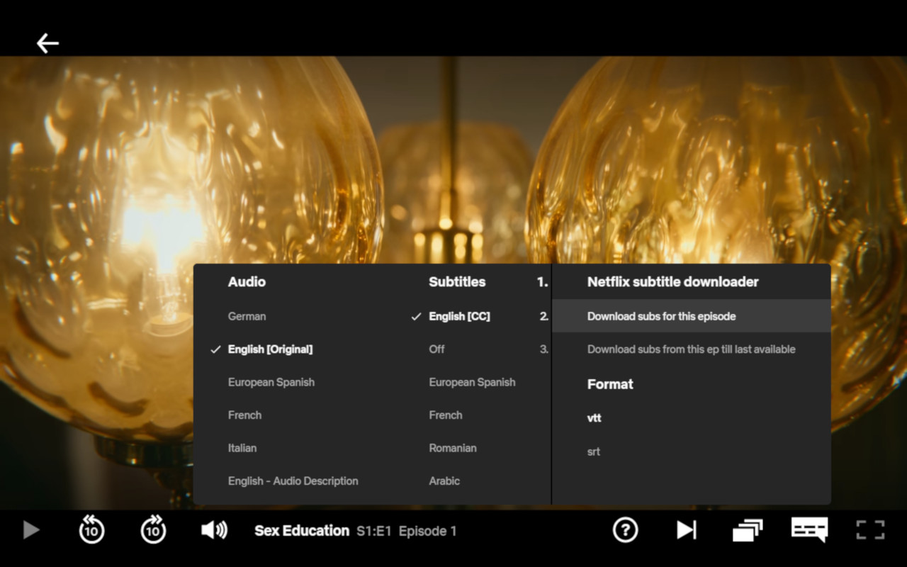

# Netflix Subtitle Loader 

### Description
This repo contains sources of extension for Chrome browser, alowing to load subtitles from Netflix series in **VTT** and **SRT**.

It is fork of [script](https://greasyfork.org/en/scripts/26654-netflix-subtitle-downloader) with added SRT support.

## Install

You can isntall it from Chrome Store following next [link]().

In case something go wrong with distribution via store, you can manually install extension following next instructions:
Download packed extension from [releases](https://github.com/vanIvan/Netflix-Subtitle-Loader/releases) page.
Install it through unpacking archive to extension folder (any), and performing next actions in Chrome **Menu** -> **More tools** -> **Extensions**, turn on **Developer mode**, and **Load unpacked** from extension folder.
 
## How to use

When watching series, go to Subtitles menu in control menu under video, there will be additional menu for downloading subtitles.

## License

Please read license before using the extension.
